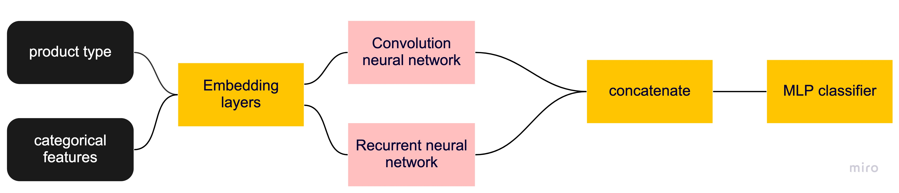

# Alpha Bank. Card Transactions Competition

Hi! I recently participated in a competition from Alfa Bank.

Task: to predict the probability of outflow of the client on his card transactions.

I was lucky enough to take 11th place!

The link to the competition is [here](https://ods.ai/competitions/dl-fintech-card-transactions).

In this competition we are dealing with sequences, one of the intuitive ways to work with them is to use recurrent and convolutional networks.

To create a model, we will use the tensorflow framework. It has everything to write arbitrary complex architectures and experiment quickly.

I think the most interesting thing will be the architecture of my solution. Before getting my best model, I tried more than 50 different architectures.

We implement the model. We will present all input features in the form of embeddings, we will configure them to get a vector representation of the transaction. We use SpatialDropout to regularize embeddings. Let's feed the sequences into the BiGRU recurrent network and Conv1D convolutional neural network. For a recurrent network, we use all the hidden network states to get an aggregated view of the transaction history - we will skip all the hidden BiGRU states through AvgPooling and through MaxPooling. For a convolutional network, we will pass all embeddings through 3 different branches of the convolutional network with different parameters, for each branch we will apply GlobalMaxPooling. Concatenate all the results. Based on this input, we will build a small MLP that acts as a classifier for the target task.

In order to detect retraining, we use Early Stopping.

Every epoch we will log the loss, as well as the roc-auc for validation and training. We will save weights after each epoch, as well as the best ones using early_stopping.

A separate question is which of the constructed models to use in order to make predictions for the test. You can choose the best one by early_stopping. In this case, there is a risk that we will fit the validation sample, especially if it is not very representative, but this is the most basic option (we use it). You can make different versions of the ensembling using weights from different eras. This approach requires additional code. Finally, you can choose a model that shows good results on validation and at the same time, is not too retrained for train sampling.

A brief diagram of the solution architecture:
